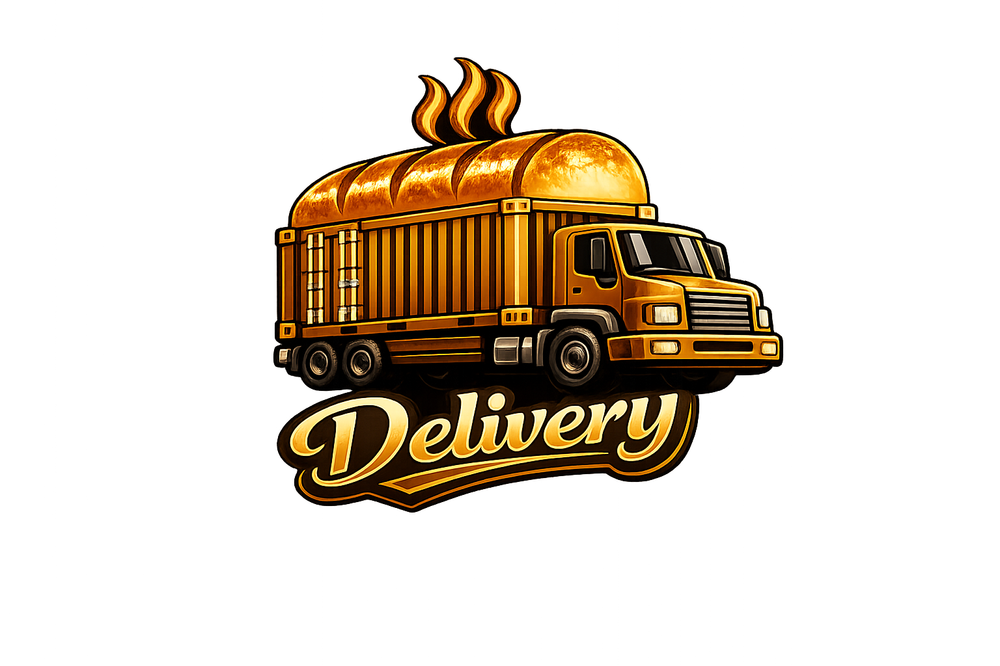

# Delivery

A gRPC-based GitOps deployment automation tool that updates Kubernetes manifest repositories. Bridges CI pipelines and GitOps controllers (ArgoCD, Flux, etc.) by automatically modifying image tags and YAML values, then committing and pushing changes.

CI 파이프라인과 GitOps 컨트롤러(ArgoCD, Flux 등)를 연결하는 gRPC 기반 배포 자동화 도구입니다. Kubernetes 매니페스트 저장소의 이미지 태그 및 YAML 값을 자동으로 변경하고 커밋, 푸시합니다.

## Documentation

[English](./docs/en/guide.md) | [한국어](./docs/ko/guide.md)

## Development

[English](./docs/en/development.md) | [한국어](./docs/ko/development.md)

## License

[GPLv3 License](./LICENSE)
